# Andrew "aBuiDev" Bui's Portfolio

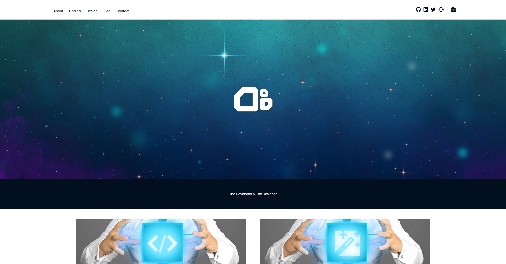

# Table of Contents

* [Deployment / Links](#Deployment)
* [User Story / Purpose](#User-Story-/-Purpose)
* [Functionality / Features](#Functionality-/-Features)
* [Sitemap](#Sitemap)
* [Screenshots](#Screenshots)
* [Target Audience](#Target-Audience)
* [Tech Stack](#Tech-Stack)

 

## Deployment / Links
Link to Deployed Website [Here](https://abuidev.netlify.app/).  
Link to GitHub Repository [Here](https://github.com/aBuiDev/aBuiDevPortfolio.git).  
Link to ed Workspace [Here](https://edstem.org/courses/4464/workspaces/pAi7odXFRqacITESx889AAlOUKTJOj3B).  
Link to Portfolio Walkthrough [Here](https://youtu.be/X8lt8OZWoC4)  

 

## User Story / Purpose

AS A USER WHO IS LOOKING FOR A DEVELOPER TO JOIN THE TEAM  
I WANT TO VIEW A VISUALLY ENGAGING AND HIGHLY TECHNICAL PORTFOLIO WEBSITE  
THAT SHOWS ME THE DEVELOPER'S PERSONALITY, IS VISUALLY/STYLISTICALLY COLLATED  
AND GIVES ME EASY ACCESSIBILITY TO CONTACT/REACH OUT TO THE DEVELOPER.   

 

## Functionality / Features

* Responsive Layouts on Mobile, Desktop and Tablet
* Two-in-One Coding and Design Portfolio
* High-Impact Animated and Interactive Cover Image
* Features Sticky Footer
* Feed-Style Blog
* User-Focused Design
* Strictly Follows Set Aesthetic Theme

 

## Sitemap

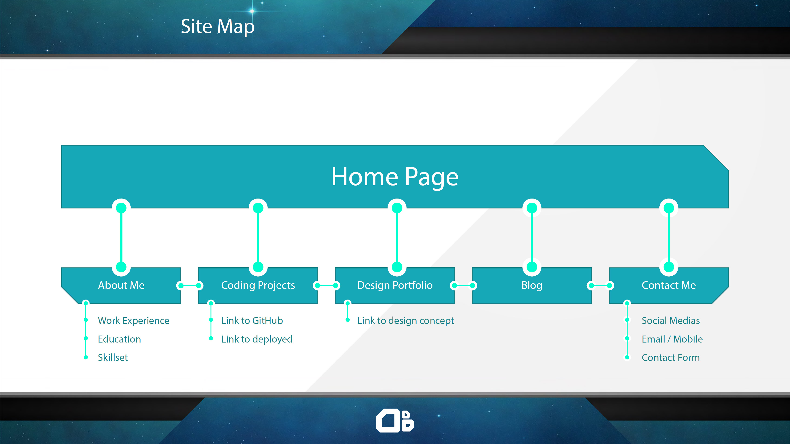

 

## Screenshots

* About Page
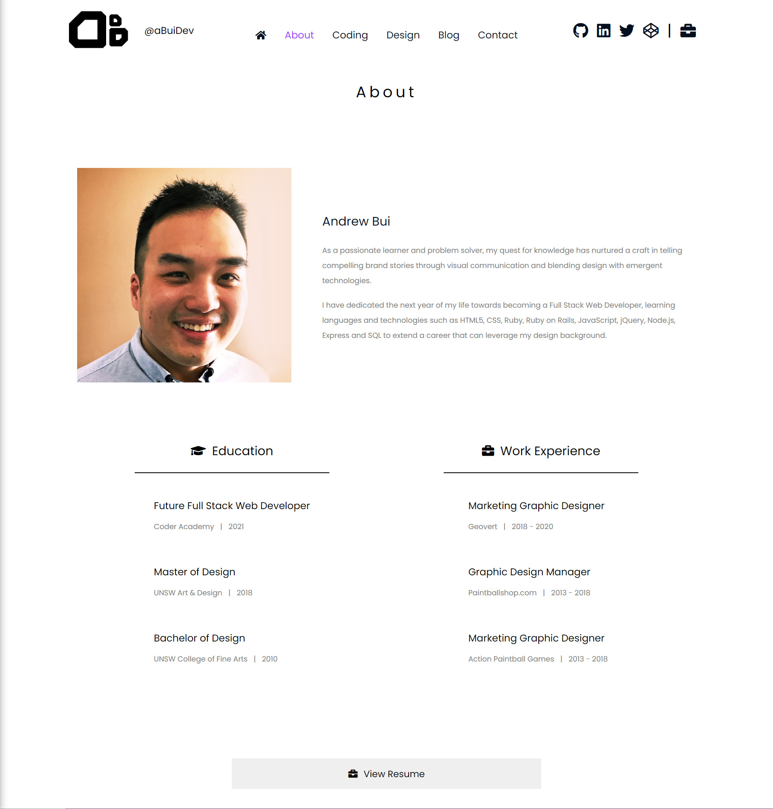  
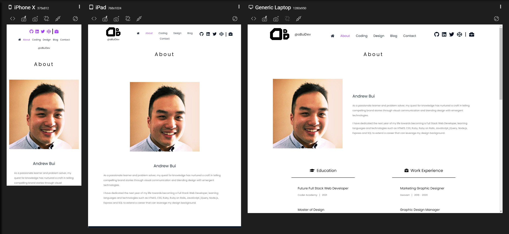  
* Blog Page
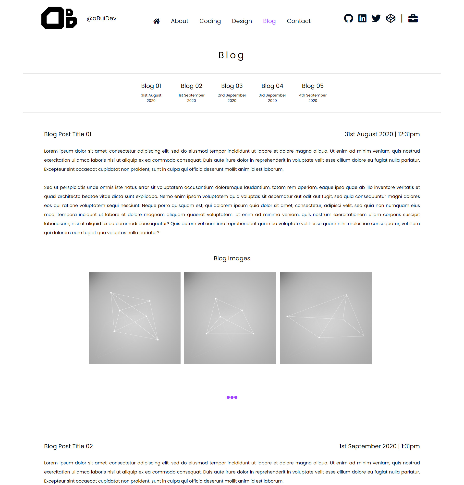  
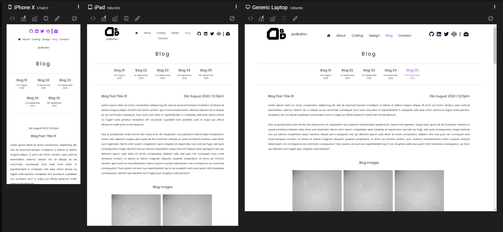  
* Coding Portfolio Page
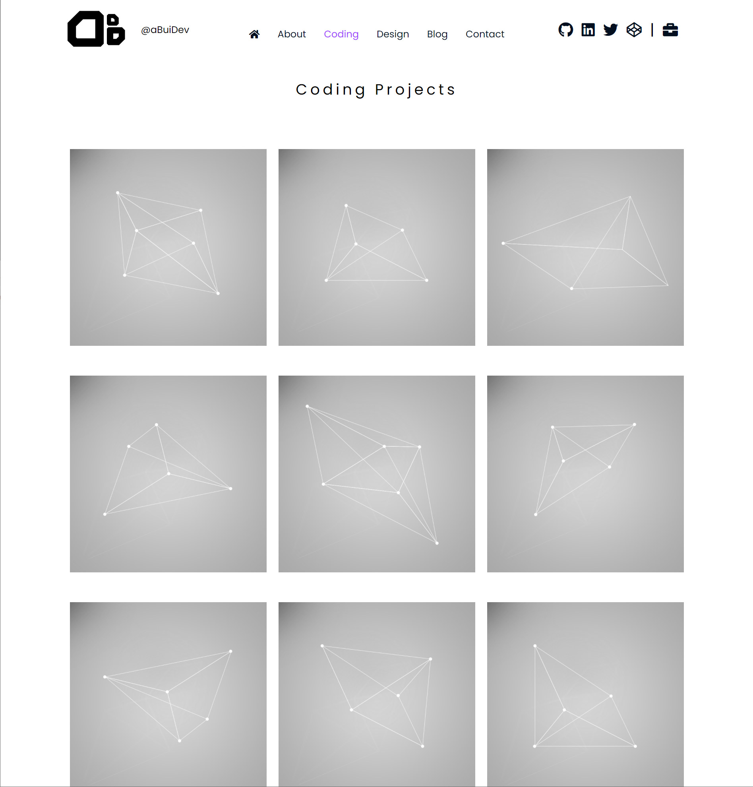  
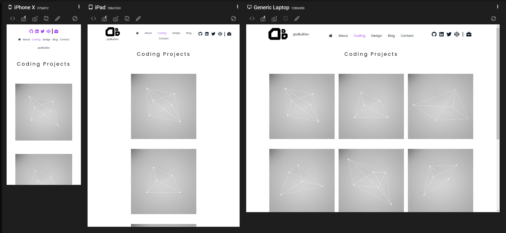  
* Design Portfolio Page
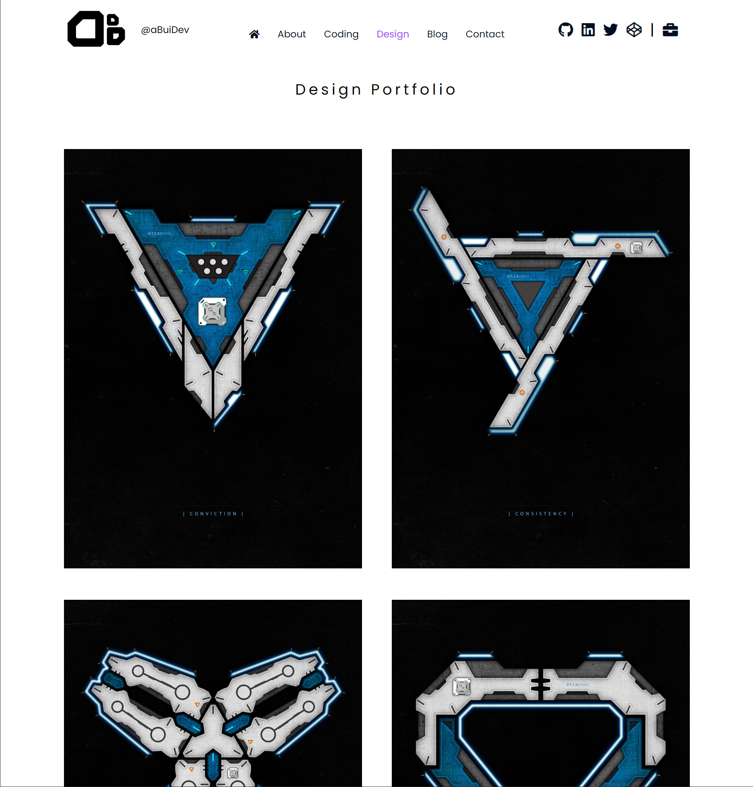  
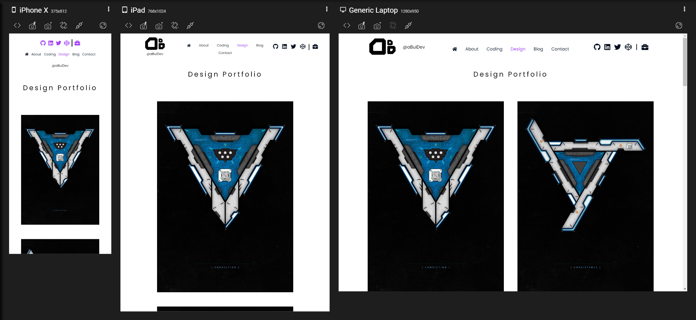  
* Contact Page
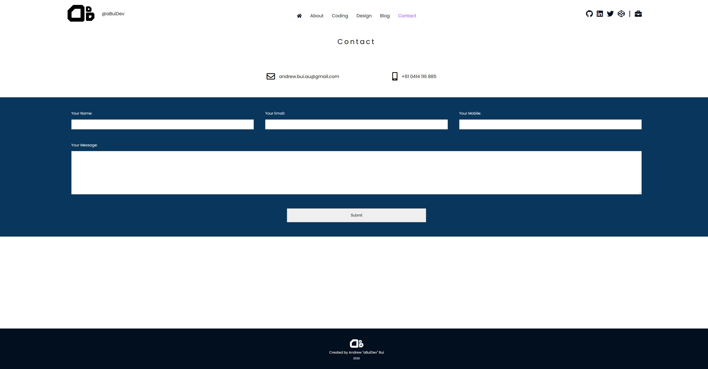   
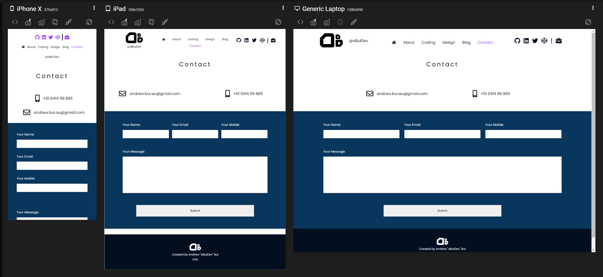  

 

## Target Audience

* Potential & Future Employers
* Potential & Future Clients

 

## Tech Stack

* Terminal (CLI)
* GitHub
* HTML5
* CSS3
* [CSS Reset](https://meyerweb.com/eric/tools/css/reset/)
* [Google Fonts](https://fonts.google.com/?query=poppins)
* [Font Awesome](https://fontawesome.com/)

 

## Design Tools

* Balsamiq (Wireframing)
* Adobe Creative Cloud
* Photoshop (Cover Image and all original placeholder artwork)
* Illustrator (aBuiDev Logo)
* [Responsively App](https://responsively.app/)

